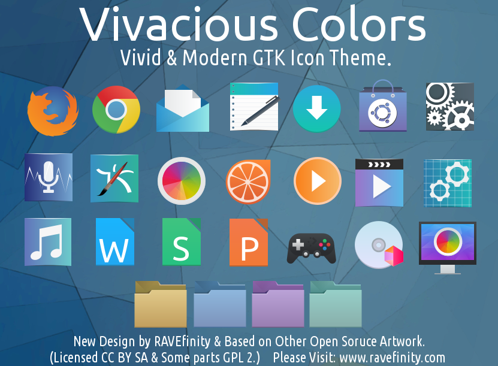
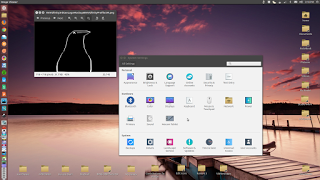
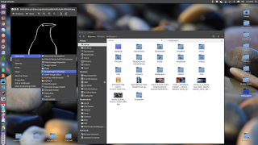

# 安装 Vivacious Colors Icon Theme
>此 icon 主题可以在各种 linux 发行版本上使用，如 Ubuntu，Debian，Linux Mint，Arch，OpenSuse等上使用。更多使用信息见[链接](http://www.ravefinity.com/p/vivacious-colors-gtk-icon-theme.html)

### Enter These Commands:
sudo add-apt-repository ppa:ravefinity-project/ppa   
sudo apt-get update   
sudo apt-get install vivacious-colors   
  
### If You Want 10 More Great Folder Colors. Then Just Install:
sudo apt-get install vivacious-folder-colors-addon   

---

)
)